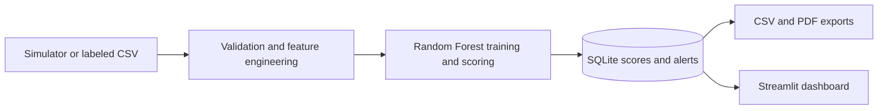

# Sompo Risk MVP

A portfolio MVP for turning noisy equipment-sensor readings into maintenance-risk signals. The project was developed as a FIAP x Sompo challenge; it is a demonstration, not a production insurance or safety system.

## Business problem

Unexpected equipment failures can cause downtime and repair costs. This prototype demonstrates a data workflow that cleans sensor readings, estimates a failure-risk score, and presents alerts for follow-up.

## Implemented features

- Generate reproducible synthetic readings, or load a labeled CSV from the command line.
- Validate required columns, remove duplicate machine/timestamp pairs, correct out-of-range values, and impute missing sensor values.
- Engineer sensor features and train a Random Forest classifier using a held-out split.
- Convert predicted failure probabilities into a 0-100 score and LOW, MEDIUM, HIGH, or CRITICAL risk levels; expose the highest-weighted risk factor.
- Store scores and alerts in SQLite, export alerts to CSV, and create a PDF summary.
- Browse stored results in a Streamlit dashboard with demo login roles.
- Include unit/integration tests and separate data, model, reporting, and security modules.

The included simulator creates the labels as well as the sensor data. Metrics from this synthetic dataset are useful for exercising the pipeline only; they are not evidence of real-world predictive performance.

## Architecture



`main.py` orchestrates the batch workflow. The `src/data`, `src/models`, `src/reports`, `src/security`, and `src/utils` packages hold the corresponding steps. JSON-reading helpers exist in the ingestion module, but the current CLI accepts CSV input only.

## Requirements and installation

Use Python 3.11 and pip:

```bash
git clone https://github.com/Kaique-ML/sompo-risk-mvp.git
cd sompo-risk-mvp
python -m venv .venv

# Windows PowerShell
.venv\Scripts\Activate.ps1

# macOS/Linux
# source .venv/bin/activate

python -m pip install --upgrade pip
pip install -r requirements.txt
```

No external database, model service, or API key is required for the local synthetic-data demo.

## Run the demo

Run the batch pipeline with deterministic synthetic data:

```bash
python main.py --n 3000
```

The run trains a model and writes results under `data/processed/`, `src/models/artifacts/`, and `outputs/`. To open the dashboard after a successful run:

```bash
streamlit run src/reports/dashboard.py
```

The dashboard reads the SQLite results produced by the pipeline. Demo accounts are defined in `src/security/auth.py`; set `SOMPO_ADMIN_PASSWORD`, `SOMPO_ANALYST_PASSWORD`, and `SOMPO_OPERATOR_PASSWORD` in the process environment before starting the app if you want to override the demo defaults.

To use a labeled CSV instead, provide the eight sensor columns `machine_id`, `timestamp`, `temperature`, `humidity`, `vibration`, `load_pct`, `operating_hours`, and `days_since_maintenance`, plus a binary `failure` target:

```bash
python main.py --input path/to/readings.csv
```

## Tests

```bash
pytest
```

The tests cover ingestion, validation, model scoring, and an end-to-end local pipeline. Model assertions use generated data.

## Limitations and future work

**Current limitations**

- Sensor readings and failure labels are synthetic; no live sensor, insurer, ERP, or external API integration is implemented.
- The model is trained again for each pipeline run and has not been validated on real equipment or failure records. Do not use its score to make operational, safety, or underwriting decisions.
- Authentication, roles, encryption, and audit utilities are demonstration components, not a production identity or key-management system.
- The current flow is batch-oriented and uses a local SQLite database; it does not provide streaming ingestion or a deployed API.

**Possible future work (not implemented):** evaluate against approved historical data, version and monitor models, integrate a real telemetry source, and harden identity, secrets, and deployment.
